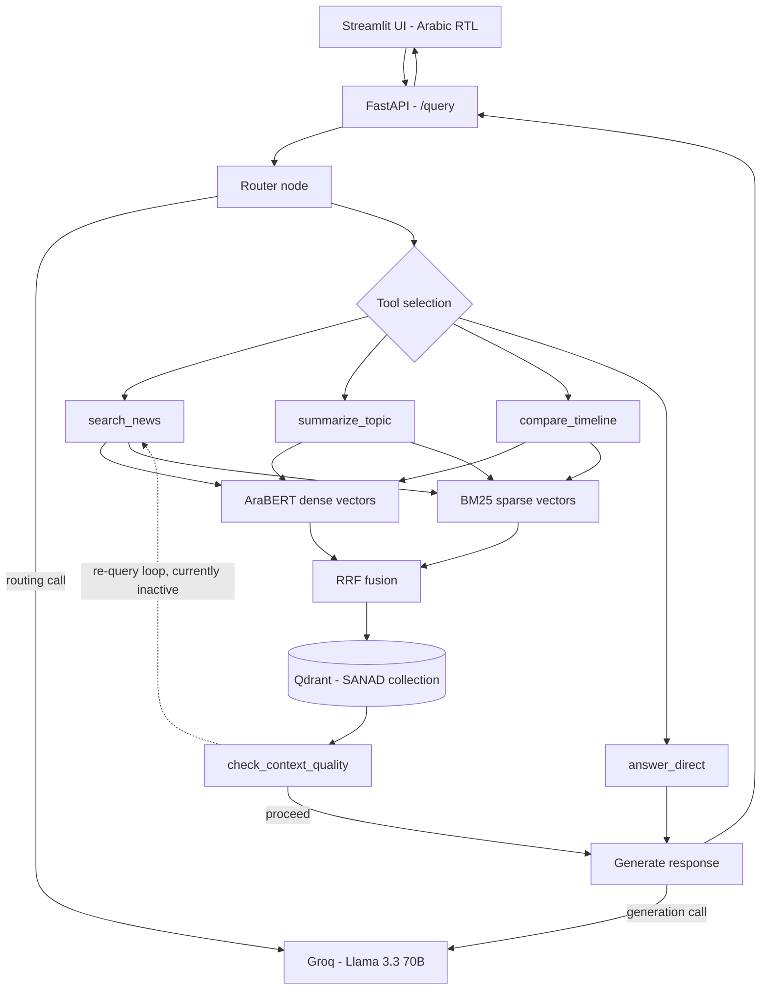
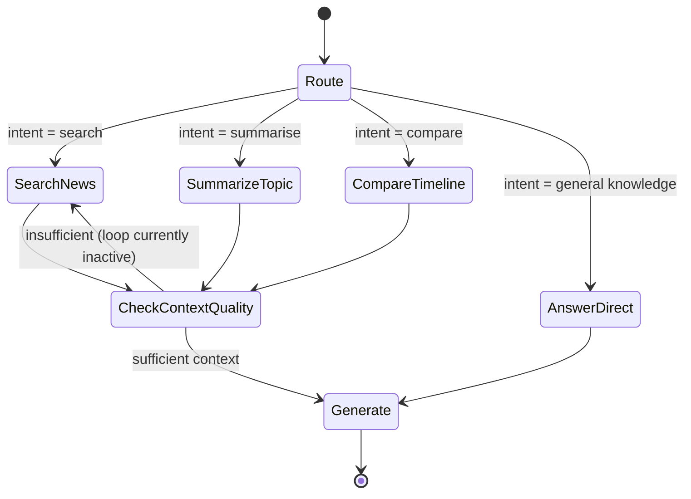

# Arabic News Agentic RAG

An agentic RAG system over Arabic news. A LangGraph state machine routes a user's Arabic question to one of four tools, each running hybrid retrieval (dense + sparse) against a local Qdrant index, then Groq's Llama 3.3 70B generates a grounded Arabic response. FastAPI backend, Streamlit frontend.

The differentiator from a standard RAG tutorial: hybrid retrieval (most tutorials only do dense), explicit tool routing via LangGraph rather than a black-box agent loop, and a visible agent trace (tool selected, retrieval loops, sources) in the UI.

## Contents

- [Architecture](#architecture)
- [Agent flow](#agent-flow)
- [Why these choices](#why-these-choices)
- [Tools](#tools)
- [Tech stack](#tech-stack)
- [Project status](#project-status)
- [Known limitations](#known-limitations)
- [Debugging highlights](#debugging-highlights)
- [Design decisions considered and rejected](#design-decisions-considered-and-rejected)
- [Planned enhancements](#planned-enhancements)
- [Setup and installation](#setup-and-installation)
- [Running the app](#running-the-app)
- [API usage](#api-usage)
- [Repository structure](#repository-structure)

## Architecture



The re-query loop is drawn as a dotted line deliberately: it exists in the graph but the threshold that would trigger it never fires in normal operation, so it's currently dead code. See [known limitations](#known-limitations).

## Agent flow

The LangGraph state machine, node by node:



LangGraph was chosen over a LangChain ReAct agent specifically so this routing logic stays inspectable: explicit nodes and edges, rather than a black-box loop.

## Why these choices

| Decision | Alternative considered | Why this way |
|---|---|---|
| LangGraph | LangChain ReAct agent | Explicit state machine, inspectable nodes and edges, visualisable graph |
| Qdrant (local) | Pinecone | Zero-setup local dev, native hybrid search via BM25 + dense in one query |
| AraBERT (`aubmindlab/bert-base-arabertv02`) | multilingual-e5, MiniLM | Purpose-built for Arabic, stronger retrieval quality than generic multilingual models |
| BM25 via FastEmbed | Elasticsearch | Simpler stack, Qdrant-native, no second service to run |
| Groq (Llama 3.3 70B) | Gemini free tier, HF Inference | Gemini's free-tier rate limits were too restrictive for iterative multi-call agent testing |
| SANAD dataset | Live scrape from day one | Get the core loop working first, add live sources once it's proven |

## Tools

| Tool | Used for |
|---|---|
| `search_news` | Specific factual questions about a topic or event |
| `summarize_topic` | Broad overview or summary requests |
| `compare_timeline` | Questions framed as development over time or comparison (currently filters by category only, not true chronological ordering) |
| `answer_direct` | General knowledge questions unrelated to news |
| `search_live_news` *(planned)* | Current-events queries, backed by a structured news API rather than live scraping |

## Tech stack

| Layer | Tool |
|---|---|
| Dataset | SANAD (`khalidalt/SANAD`, AlKhaleej split), ~26,000 chunks |
| Dense embeddings | AraBERT v2, 768-dim, loaded via `transformers` directly |
| Sparse embeddings | BM25 via FastEmbed (`Qdrant/bm25`) |
| Vector DB | Qdrant, local mode (Docker migration planned) |
| Agent framework | LangGraph |
| LLM inference | Groq (Llama 3.3 70B) |
| Backend | FastAPI |
| Frontend | Streamlit |
| Environment | Python 3.11, Windows |

## Project status

| Phase | Status |
|---|---|
| 1. Data and indexing foundation | Done |
| 2. Hybrid retrieval layer | Done |
| 3. Agent tool definitions (4 of 5 tools) | Done |
| 4. LangGraph agent loop | Done |
| 5. FastAPI backend + Streamlit frontend | Done |
| 6. Deployment and polish | Not started |

## Known limitations

Disclosed here rather than left for someone else to find:

- **Dataset recency** — SANAD covers 2017–2019. Questions about current events return stale context or nothing, until the live news tool ships.
- **Category imbalance** — the AlKhaleej split is politics-heavy, so sports and finance queries often return politics-adjacent chunks.
- **No real date filtering** — `compare_timeline` filters by category only. SANAD lacks reliable per-article date fields, so chronological ordering isn't implemented.
- **Re-query loop is decorative** — `check_context_quality`'s threshold effectively never fires in normal operation.
- **Local Qdrant isn't production-suitable** at current usage patterns; also blocks `uvicorn --reload` due to a file-lock conflict between the watcher and worker process. Requires the Docker migration.

## Debugging highlights

Most of the engineering time on this project went into debugging, not features. A sample of what came up:

| Problem | Root cause | Fix |
|---|---|---|
| AraBERT tokenizer hung on Windows | `sentence-transformers` wrapper deadlocked on load | Load via `transformers` `AutoTokenizer`/`AutoModel` directly, `TOKENIZERS_PARALLELISM=false` |
| Phantom duplicate/stale index data | Relative Qdrant paths resolved differently depending on working directory | Single absolute path used everywhere |
| Category filter leaked across categories | Qdrant `query_filter` applied post-fusion only, not to each `Prefetch` sub-query | Filter passed into each `Prefetch` stage individually |
| Duplicate points on re-index | Random UUIDs meant re-indexing without deleting the collection stacked duplicates | Deterministic MD5 hash IDs from `source_idx` + chunk id |
| Silent routing fallback | Routing prompt used `summarise_topic`, `TOOL_MAP` used `summarize_topic` — every summarise-intent query silently fell back to `search_news` | Spelling reconciled between prompt and map |
| `KeyError` under FastAPI only, not standalone | `AgentState.response` typed `str` but initialised as `None` | Changed to `Optional[str]` |

## Design decisions considered and rejected

**Live per-query Al Jazeera scraping**, triggered from a LangGraph conditional edge, was evaluated and rejected: it added an LLM call to every query just to decide whether to scrape, was fragile against CSS selector changes on the live site, had an asyncio/sync execution mismatch, and was the wrong fit for a single-user demo. The chosen approach instead is a `search_live_news` tool backed by a structured news API, with scraping demonstrated separately as an offline scheduled ingestion script.

## Planned enhancements

- Scheduled Al Jazeera scraping (offline, `trafilatura`, per category, every few hours) feeding a separate `arabic_news_live` Qdrant collection
- Streaming "thinking" UI exposing actual LangGraph node completion events, not a fake spinner
- Post-response analysis panel: tool selected, source counts, dense-only vs sparse-only vs fused retrieval comparison
- Advanced playground panel: model selector, tool override, retrieval mode toggle, parameter sliders
- Headlines strip on dashboard load, sourced from the live collection
- Cross-encoder reranker, starting with a hosted service to avoid the local model-loading issues already hit with AraBERT

## Setup and installation

1. Activate the project environment:
   - Windows PowerShell: `.\rag_env\Scripts\Activate.ps1`
   - Linux/macOS: `source rag_env/bin/activate`

2. Install dependencies:

   ```bash
   pip install fastapi uvicorn streamlit requests python-dotenv langchain-groq langchain-huggingface transformers qdrant-client fastembed
   ```

   A pinned `requirements.txt` is on the roadmap; for now this list reflects direct dependencies only.

3. Create a `.env` file in the project root:

   ```env
   GROQ_API_KEY=your_groq_api_key_here
   ```

## Running the app

Start the backend:

```bash
uvicorn api.main:api --reload --host 0.0.0.0 --port 8000
```

Then, in a second terminal, start the frontend:

```bash
streamlit run frontend/app.py
```

Open `http://localhost:8501`.

Run from the repository root — the Qdrant path is currently relative and depends on it (hardcoding this out is a pending fix).

## API usage

- `GET /health` — health check
- `POST /query` — sends a query to the agent, returns the response payload

```bash
curl -X POST http://localhost:8000/query \
  -H "Content-Type: application/json" \
  -d '{"query":"ما آخر التطورات في الأخبار الاقتصادية؟"}'
```

## Repository structure

```
.
├── api/
│   └── main.py          # FastAPI service: /query, /health
├── agent/
│   ├── graph.py          # LangGraph graph, routing, generation
│   └── tools.py          # search_news, summarize_topic, compare_timeline, answer_direct
├── frontend/
│   └── app.py             # Streamlit UI
├── data/
│   ├── qdrant_db/         # Local Qdrant storage (gitignored)
│   └── ...                # Indexing and exploration notebooks
├── .env                    # GROQ_API_KEY (gitignored)
└── README.md
```
