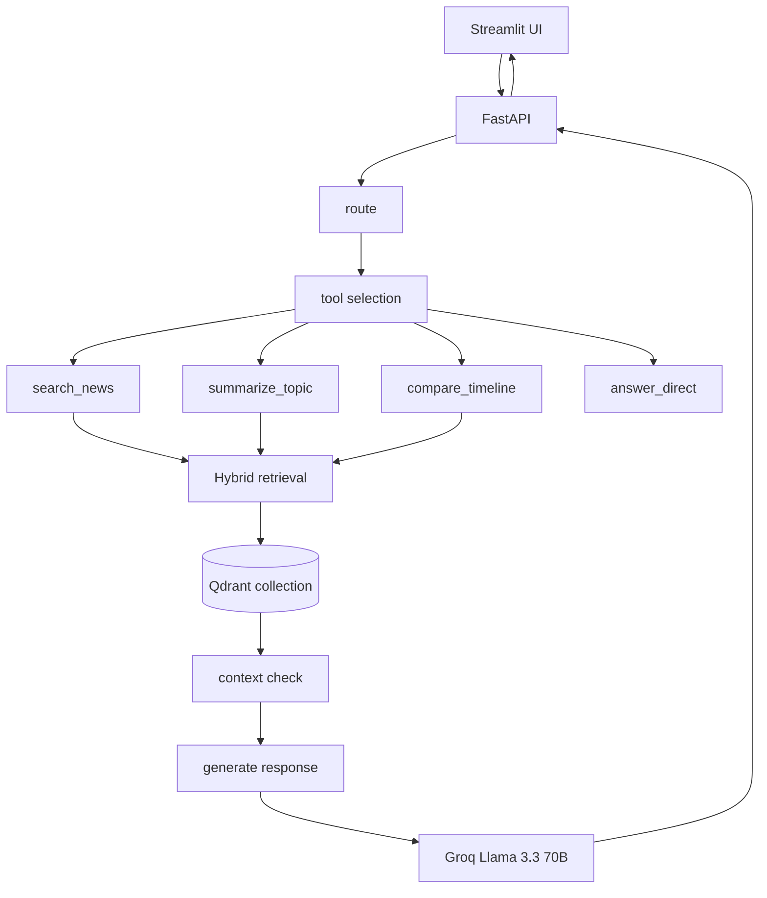

# Arabic News Agentic RAG

An Arabic news assistant built around a LangGraph-based agent, hybrid retrieval over a local Qdrant index, and Groq-powered answer generation. The system routes Arabic user questions to one of four tools, retrieves relevant passages, and then writes a grounded Arabic news-style response.

## What is implemented now

The current repository already includes the core pieces of the app:

- A LangGraph workflow for routing user questions to one of four tools:
  - `search_news`
  - `summarize_topic`
  - `compare_timeline`
  - `answer_direct`
- Hybrid retrieval using:
  - dense embeddings from AraBERT
  - sparse BM25 retrieval via FastEmbed
  - RRF fusion for combining both signals
- A FastAPI backend with:
  - `POST /query`
  - `POST /query/stream`
  - `GET /health`
- A Streamlit frontend in Arabic with live status updates and source display
- A prototype live scraper module for collecting Arabic news content into a separate Qdrant collection

## Current architecture



## How the agent works

1. The router node examines the Arabic query and selects one tool.
2. The chosen tool runs retrieval against the Qdrant index.
3. The graph checks whether enough context was retrieved.
4. If the context is sufficient, the generator produces an Arabic answer.
5. The backend and frontend expose this flow to the user in a visible way.

## Tool behavior

| Tool | Purpose |
|---|---|
| `search_news` | Specific factual questions about a topic or event |
| `summarize_topic` | Broad overview or summary requests |
| `compare_timeline` | Questions about development or comparison over time |
| `answer_direct` | General knowledge questions unrelated to news |

## Tech stack

| Layer | Tool |
|---|---|
| Agent framework | LangGraph |
| LLM | Groq Llama 3.3 70B |
| Dense embeddings | AraBERT via `sentence-transformers` / `transformers` |
| Sparse embeddings | BM25 via FastEmbed |
| Vector DB | Qdrant |
| Backend | FastAPI |
| Frontend | Streamlit |
| Environment | Python 3.11, Windows |

## Project status

| Area | Status |
|---|---|
| Core routing and tool selection | Done |
| Hybrid retrieval layer | Done |
| FastAPI backend | Done |
| Streamlit frontend | Done |
| Live web scraper | In progress / not fully integrated yet |
| Deployment polish | Not started |

## Web scraper status

The scraper module is present in [agent/live_scraper.py](agent/live_scraper.py), but it is still a work in progress. It is not yet fully reliable or fully integrated into the main query flow. In other words, the web scraper is not done yet.

Current scraper work is focused on:

- collecting Arabic news content from public sources
- cleaning and chunking content
- ingesting it into a separate live collection
- making the flow robust enough to use in production-style retrieval

## Current limitations

- The app currently depends on a local Qdrant instance running at `localhost:6333`.
- The retrieval layer uses the existing indexed collection and does not yet fully rely on the live scraper output.
- The dataset is still mostly static and may not reflect very recent events.
- The scraper is experimental and not yet part of the main runtime path.

## Setup

1. Activate the project environment:
   - Windows PowerShell: `./rag_env/Scripts/Activate.ps1`
   - Linux/macOS: `source rag_env/bin/activate`

2. Install dependencies:

```bash
pip install -r requirements.txt
```

3. Create a `.env` file in the project root:

```env
GROQ_API_KEY=your_groq_api_key_here
```

4. Make sure Qdrant is available locally on port `6333`.

## Run the app

Start the backend:

```bash
uvicorn api.main:api --reload --host 0.0.0.0 --port 8000
```

Start the frontend in a second terminal:

```bash
streamlit run frontend/app.py
```

Open `http://localhost:8501`.

## Repository structure

```text
.
├── agent/
│   ├── graph.py
│   ├── live_scraper.py
│   └── tools.py
├── api/
│   └── main.py
├── frontend/
│   └── app.py
├── data/
├── requirements.txt
└── README.md
```

## Next steps

- finish and stabilize the live scraper
- connect the scraper output into the main retrieval flow
- improve retrieval quality and freshness
- add better deployment and container support
