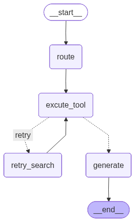
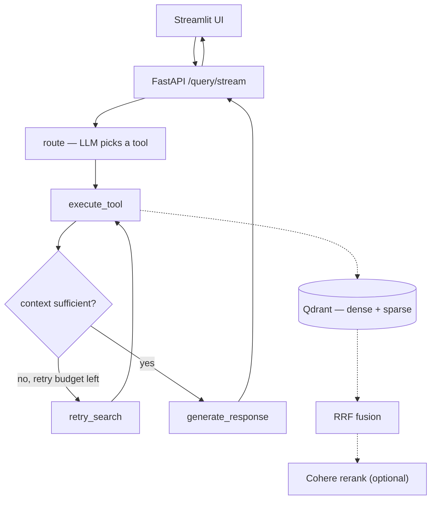

# Arabic News Agentic RAG

An agentic RAG system over Arabic news. A LangGraph state machine routes a user's Arabic
question to one of four tools, each doing hybrid retrieval (AraBERT dense + BM25 sparse +
RRF fusion, optionally reranked with Cohere) against a Qdrant index, then Groq generates a
grounded Arabic response. FastAPI backend, Streamlit frontend with a live agent trace.


<p align="center">
  
</p>

<!-- Replace assets/demo.gif with a short screen recording — ~20-30s covering one query
     through search_news showing the streaming status line, the response, the source
     panel, and the dense/sparse/fused/reranked comparison. That single clip covers most
     of what's described in text below. -->

---

## What makes this different from a standard RAG tutorial

- **Hybrid retrieval, not just dense.** Unlike many introductory RAG implementations, this
  runs AraBERT dense search and BM25 sparse search in parallel and merges them with
  Reciprocal Rank Fusion. The UI shows the dense-only, sparse-only, fused, and reranked
  result lists side by side for the same query, so the difference between hybrid and
  single-method retrieval is something you can see, not just a claim in this README.
- **Explicit agent routing via LangGraph, not a black-box loop.** A router node picks one
  of four tools per query; a conditional edge retries retrieval once if the first pass comes
  back thin. The graph is inspectable and exportable as an image (below), not a prompt
  wrapped in a while-loop.
- **A real evaluation suite.** Router accuracy, retrieval recall/precision/MRR across four
  retrieval modes, LLM-as-judge generation scoring, and per-stage latency — all
  reproducible with one command. Sample size and methodology limitations are stated
  plainly rather than hidden. See [Evaluation](#evaluation) below.

## Dataset

Corpus: [SANAD](https://huggingface.co/datasets/khalidalt/SANAD) (`khalidalt/SANAD`,
AlKhaleej split) — the full split contains 190k+ articles across 7 categories; this
project indexes a subset. Current indexed collection: **26,320 chunks** across Politics,
Finance, Medical, Religion, Sports, Tech, and Culture, after cleaning, chunking, and
deduplication. Embedded with AraBERT v2 (768-dim dense) alongside BM25 sparse vectors.

## Screenshots

<!-- Add 2-3 screenshots here alongside the demo gif: the hybrid comparison panel
     (dense/sparse/fused/reranked columns), the evaluation script's terminal output,
     and the advanced settings panel. Images land better than prose on GitHub. -->

## Agent graph

<p align="center">
  
</p>

This is the actual compiled graph, not a hand-drawn diagram. To regenerate it after
changing `agent/graph.py`:

```python
graph_image = app.get_graph().draw_mermaid_png()
with open("assets/agent_graph.png", "wb") as f:
    f.write(graph_image)
```

Conceptual flow, for reference alongside the image:


```mermaid
flowchart TD
    UI["Streamlit UI"] --> API["FastAPI /query/stream"]
    API --> ROUTE["route — LLM picks a tool"]
    ROUTE --> EXEC["execute_tool"]
    EXEC --> CHECK{"context sufficient?"}
    CHECK -- "no, retry budget left" --> RETRY["retry_search"]
    RETRY --> EXEC
    CHECK -- "yes" --> GEN["generate_response"]
    GEN --> API
    API --> UI

    EXEC -.-> QDRANT[("Qdrant — dense + sparse")]
    QDRANT -.-> RRF["RRF fusion"]
    RRF -.-> RERANK["Cohere rerank (optional)"]
```

## The four tools

| Tool | Purpose |
|---|---|
| `search_news` | Specific factual questions about a topic or event. Full hybrid retrieval + optional reranking. |
| `summarize_topic` | Broad overview requests. Pulls a wider pool (top 8+) and synthesizes across sources instead of answering from one. |
| `compare_timeline` | Category-scoped retrieval — narrows results to a specific news category. **Not** chronological comparison: SANAD lacks reliable per-article dates, so true timeline ordering isn't implemented. Disclosed here rather than left implied by the name. |
| `answer_direct` | General-knowledge questions unrelated to news. No retrieval — the LLM answers directly, and the UI says so instead of showing an empty sources panel. |

Router accuracy and the specific confusion this introduces (see below) are measured, not
assumed.

## Interface

- Arabic RTL input, streamed status updates as the agent moves through routing → retrieval
  → generation (real graph state via Server-Sent Events, not a decorative spinner).
- Expandable sources panel: every chunk that fed the answer, with category and score.
- Hybrid comparison panel: dense-only / sparse-only / fused / reranked results for the same
  query, four columns, side by side.
- Advanced settings (collapsed by default): model selector (compare Groq model
  speed/quality), tool override (force a specific tool for debugging or demo), retrieval
  mode toggle (hybrid / dense / sparse), `top_k`, category filter, reranker on/off, minimum
  relevance threshold, temperature.

## Evaluation

Automated evaluation across four dimensions, using synthetic queries generated by an LLM
from the actual indexed corpus — not hand-picked. Code in [evaluation/](evaluation/).

| Metric | Result |
|---|---|
| Router accuracy | 83.3% |
| Retrieval recall@5 (hybrid + reranker) | 66.7% |
| Generation groundedness (LLM-as-judge) | 3.67/5 |
| Average end-to-end latency | 2.63 sec |

**Methodology and honest caveats:**

- n=6 labeled queries — kept small deliberately to stay under the Cohere trial tier's
  10-calls/minute rate limit during iteration. Numbers are directional, not statistically
  tight. Expanding the labeled set is a tracked follow-up, not skipped by accident.
- Generation is judged by the same model family that generates the response (Llama 3.3 70B
  via Groq), which has a documented self-favoring bias in LLM-as-judge setups. Treat
  correctness/groundedness/completeness as directional signal, not independent
  verification.
- The routing confusion matrix shows `summarize_topic` at 50% — several queries meant to
  test broad-overview intent were routed to `answer_direct` instead. This is a real,
  identified boundary the router doesn't disambiguate well yet, kept visible rather than
  smoothed over. Root cause and fix are tracked (few-shot examples needed in the routing
  prompt, since abstract tool descriptions alone aren't enough at this boundary).
- Retrieval numbers can vary slightly run-to-run at identical settings — Qdrant's HNSW
  index is approximate nearest-neighbor search, not exact, so marginal candidates near the
  prefetch cutoff can shift between runs.

Reproduce with:

```bash
python evaluation/generate_queries.py   # regenerate synthetic queries, or reuse existing
python evaluation/run_eval.py           # full suite: routing, retrieval, generation, latency
```

Retrieval mode comparison (dense / sparse / hybrid / hybrid+reranked) is broken out
per-mode in the script output — hybrid and reranking both show a measurable lift over
either signal alone.

## Known limitations

- **Dataset recency.** Core corpus is SANAD (2017–2019 AlKhaleej split). Queries about
  current events return stale context or nothing from the static index. A live-source
  pipeline was built (see below) but two of three planned sources are currently blocked.
- **Category imbalance.** AlKhaleej is politics-heavy; sports and finance queries sometimes
  return politics-adjacent chunks. Retrieval evaluation's per-category breakdown makes this
  visible rather than hiding it in an aggregate score.
- **`compare_timeline` is not chronological**, as noted above — category-scoped only.
- **Cohere's trial tier caps reranking at 10 requests/minute.** This affects both live
  reranking under concurrent load and evaluation run reproducibility — noted here since
  it's a real constraint on the current deployment, not something to discover by hitting
  a 429.

## Lessons learned

- Hybrid retrieval only became consistently better than either method alone once reranking
  was added — RRF fusion helps, but the reranked numbers were the more reliable win across
  eval runs (see the retrieval mode comparison in [Evaluation](#evaluation)).
- Qdrant's filtering behaves differently during RRF fusion than expected — a top-level
  filter doesn't reach each `Prefetch` stage automatically, it has to be passed explicitly
  to each one.
- Approximate nearest-neighbor search (Qdrant's HNSW index) introduces small but real
  variance between otherwise-identical evaluation runs — worth knowing before trusting a
  single number too tightly.
- Windows-specific tokenizer deadlocks in `sentence-transformers` required loading AraBERT
  through `transformers` directly instead.
- Building a reproducible evaluation suite took longer than building the agent loop itself
  — mostly rate-limit handling and deciding what "ground truth" honestly means without a
  hand-labeled dataset.
- **Live source pipeline is partially blocked, and that's a real finding worth stating
  plainly:** BBC Arabic ingestion works cleanly via their public feed mirror plus
  keyword-based categorization (BBC has no clean per-category URLs). Al Jazeera and Al
  Arabiya both actively block direct scraping — Al Jazeera resets connections mid-request,
  Al Arabiya returns explicit 403s — consistent with Cloudflare-class bot detection
  operating below the HTTP layer, which header spoofing can't defeat. Next attempts, in
  order: `curl_cffi` with browser TLS impersonation, falling back to a structured news API
  filtered to those two domains, or a headless-browser approach as a last resort. Code for
  all three sources exists in `agent/live_scraper.py`; only BBC is currently wired into a
  live collection.

## Tech stack

| Layer | Tool |
|---|---|
| Dataset | SANAD (`khalidalt/SANAD`, AlKhaleej split) |
| Dense embeddings | AraBERT v2 (`aubmindlab/bert-base-arabertv02`, 768-dim) |
| Sparse embeddings | BM25 via FastEmbed (`Qdrant/bm25`) |
| Reranking | Cohere `rerank-multilingual-v3.0` (optional, toggleable) |
| Vector DB | Qdrant |
| Agent framework | LangGraph |
| LLM inference | Groq (Llama 3.3 70B / 3.1 8B Instant, selectable) |
| Backend | FastAPI (streaming via SSE) |
| Frontend | Streamlit |
| Evaluation | Custom suite — routing, retrieval, generation (LLM-as-judge), latency |
| Deployment | HuggingFace Spaces (Docker SDK) |

## Repository structure

```text
.
├── agent/
│   ├── graph.py            # LangGraph state machine, routing, generation prompts
│   ├── tools.py             # Four tools, hybrid retrieval, reranking
│   └── live_scraper.py      # Multi-source live ingestion (BBC working, AJ/Al Arabiya blocked)
├── api/
│   └── main.py               # FastAPI — /query, /query/stream, /health
├── frontend/
│   └── app.py                 # Streamlit UI — streaming trace, sources, comparison panels
├── evaluation/
│   ├── routing_eval.py
│   ├── retrieval_eval.py
│   ├── generation_eval.py
│   ├── latency_eval.py
│   ├── generate_queries.py    # Synthetic query + ground-truth generation
│   ├── run_eval.py             # Orchestrates all four, prints README-ready summary
│   └── data/
├── data/
│   └── qdrant_db/               # Indexed corpus (bundled for deployment, gitignored for dev)
├── assets/
│   ├── demo.gif
│   └── agent_graph.png
├── requirements.txt
├── .env.example
└── README.md
```

## Setup

1. Create the environment (Python 3.11 required — the ML stack does not have pre-built
   wheels for newer versions):

```bash
python -m venv rag_env
# Windows: .\rag_env\Scripts\Activate.ps1
# Linux/macOS: source rag_env/bin/activate
pip install -r requirements.txt
```

2. Run Qdrant locally via Docker:

```bash
docker run -d -p 6333:6333 -p 6334:6334 \
  -v "${PWD}/qdrant_storage:/qdrant/storage" \
  --name qdrant qdrant/qdrant
```

3. Copy `.env.example` to `.env` and fill in your keys:

```env
GROQ_API_KEY=your_groq_api_key_here
COHERE_API_KEY=your_cohere_api_key_here   # optional — enables reranking
```

4. Index the corpus (first run only — see `data/` notebooks for the indexing pipeline).

## Run the app

```bash
uvicorn api.main:api --reload --host 0.0.0.0 --port 8000
```

```bash
streamlit run frontend/app.py
```

Open `http://localhost:8501`.

## API

```
GET  /health
POST /query          — blocking, full agent result
POST /query/stream    — Server-Sent Events, live status updates + final result
```

```bash
curl -X POST http://localhost:8000/query \
  -H "Content-Type: application/json" \
  -d '{"query": "ما آخر التطورات في الوضع السوري؟"}'
```

Optional fields on both endpoints: `model`, `tool_override`, `retrieval_mode`, `top_k`,
`category_filter`, `use_reranker`, `min_score`, `temperature` — all default to sensible
values if omitted.

## Deployment

Deployed as a single Docker container on HuggingFace Spaces — FastAPI and Streamlit both
run inside it, with Qdrant in embedded mode using data baked into the image at build time
(no separate Qdrant service needed for the deployed version; local dev uses the Docker
Qdrant service above instead — a deliberate difference, not an inconsistency). See
`Dockerfile` and `start.sh` in the repo root.

## What's next

- Resolve Al Jazeera / Al Arabiya scraping (curl_cffi impersonation attempt, or fall back
  to a structured news API for those two sources specifically)
- Wire the live collection into `search_news` as a fifth routing option once the source
  pipeline is reliable
- Fix the `summarize_topic` / `answer_direct` routing boundary (few-shot examples in the
  routing prompt — already root-caused, not yet applied)
- Expand the evaluation labeled set past n=6
- Headlines strip on the dashboard, sourced from the live collection once it exists

## A few debugging stories

Full log in [docs/debugging.md](docs/debugging.md) — nine issues total. Three that took
the longest:

- **Re-indexing silently didn't take effect, cost a multi-hour debugging loop.**
  Indexing and querying scripts used inconsistent relative Qdrant paths, resolving to
  different physical folders depending on working directory. Fixed with a single
  dynamically-resolved path used everywhere.
- **Filtered searches leaked the wrong categories into results.** Qdrant's top-level
  `query_filter` only applies after RRF fusion, not to each `Prefetch` stage — had to pass
  the same filter into each `Prefetch` individually.
- **Al Jazeera / Al Arabiya scraping failed with connection resets and 403s** despite
  realistic browser headers — Cloudflare-class bot detection operating at the TLS
  fingerprint level, which header spoofing can't defeat. Diagnosed and documented as a
  disclosed limitation with a concrete next attempt (`curl_cffi`), rather than retried
  endlessly.

[Read the rest →](docs/debugging.md)